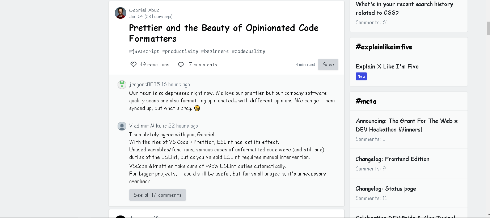

  

<h1 align="center">
  fontify
</h1>

 

## What is Fontify?
* fontify allows user to feel the real beauty of cursive font.

# How to download Fontify

* git repo is public you can clone it from here (for developers only)
* or from chrome webstore.

# ScreenShots

# How to Install as Chrome Extension?
 * * You can download this from the Chrome Store:

* The fontify Chrome Store Page
* To install from source added as an "unpacked extension":
* download the zip file from releases
* unzip the file
* visit chrome://extensions
* switch on Developer mode
* Click Load Unpacked
* choose the extension folder (the one with the manifest.json in it)

# ThankYou 

## © fotify 2020

